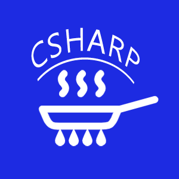

# Welcome to CookPopularUI 

## **介绍**
CookPopularUI是支持.Net462+、.NetCore3.1、.Net6.0+的一款Xaml控件库。目前只包含WPF控件库，其中参考了一些资料，提供了70多款常用控件，并持续更新。如果你的项目用到此库，不要忘记点个赞，有问题可加QQ群交流：658794308，欢迎大家参与开发和指出问题。
***

### 准备新加入控件
- 方形布局(子项靠近边框/子项居中)、圆形布局、ControlPanel
- 增加PopupMenuButton
- Boxes：增加相框控件
- ProcessBar
- WaterMark
- ButtonGroup、ToggleButtonGroup、CheckBoxGroup、RadioButtonGroup
- PageScroller
- Extensions  
  CookPopularUI.WPF.QRCode  
  CookPopularUI.WPF.Animation  
  CookPopularUI.WPF.Draggable  
  CookPopularUI.Compress  

### 遗留问题
- WPFDemo采用Prism、Caliburn.Micro、ReactiveUI、CommunityTools、(WAF、MEF)这几种mvvm框架示例
- MessageDialog系统菜单栏应该有关闭和移动按钮可以点击
- 窗体ShowDialog时标题栏应该闪烁
- PropertyGrid中自定义Item编辑器，DockPanel.Dock
- 资源国际化扩展（可自定义）
- Demo中Button类别分开展示
- UniformSpacePanel水平时水平设置无效、垂直时垂直设置无效
- SideBarEx动画不和谐
- ItemsControl类型控件大量数据性能测试

### 单元测试
1. 单元测试
2. BentchMark性能测试

## ⭐️ Stargazers

<!-- ## 🏆 Forkers

 -->