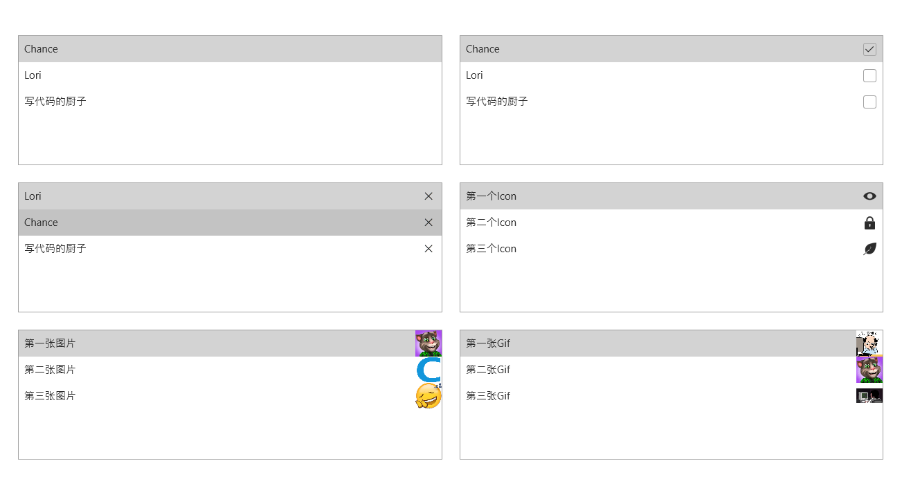
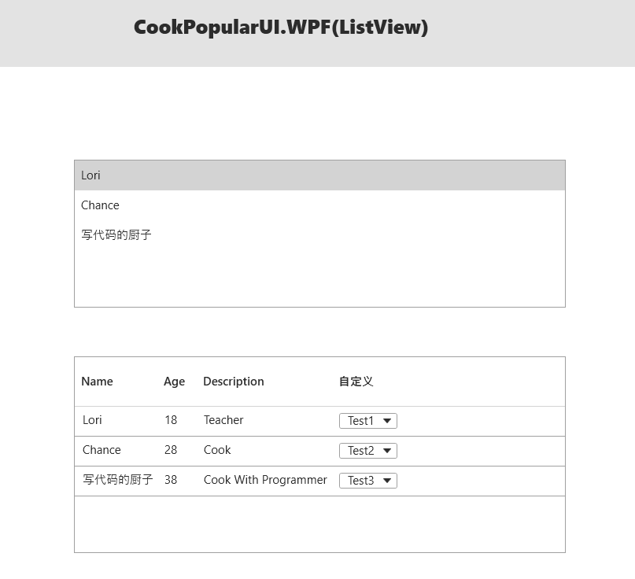
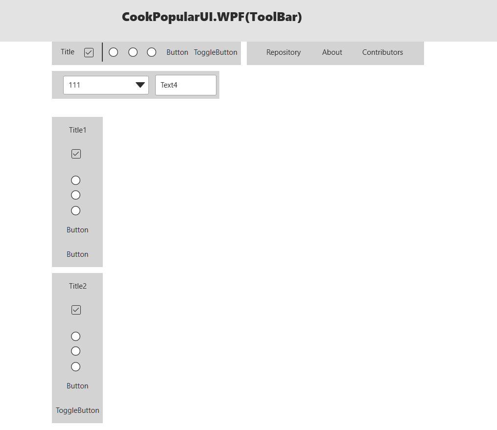

[](https://github.com/CookCSharp/CookPopularUI)

# Welcome to CookPopularUI

## **介绍**

CookPopularUI是支持.Net462+、.NetCore3.1、.Net6.0+的一款Xaml控件库。目前只包含WPF控件库，其中参考了一些资料，提供了100多款常用控件，并持续更新。如果你的项目用到此库，不要忘记点个赞，有问题可加QQ群交流：658794308，欢迎大家参与开发和指出问题。
***

## **使用**

- 添加Nuget包引用
  ```
  <PackageReference Include="CookPopularUI.WPF" Version="1.0.1-preview2" />
  ```

- 添加如下代码即可全部引用（两种方式皆可）
  ```
  <Application.Resources>
      <ResourceDictionary>
            <ResourceDictionary.MergedDictionaries>
                <!--<ResourceDictionary Source="pack://application:,,,/CookPopularUI.WPF;component/Themes/DefaultPopularColor.xaml" />-->
                <!--<ResourceDictionary Source="pack://application:,,,/CookPopularUI.WPF;component/Themes/DefaultPopularControl.xaml" />-->
                <ui:PopularTheme Language="English" Theme="Light" />
            </ResourceDictionary.MergedDictionaries>
      </ResourceDictionary>
  </Application.Resources>
  ```

## **效果**

- **Home**
    

- **BlockBar**
    

- **Border**
    
    
    

- **Button**
    

- **Carousel**
    

- **CheckBox**
    

- **ColorPicker**
    

- **ComboBox**
    

- **DataGrid**
    

- **DateTime**
    

- **DialogBox**
    

- **Expander**
    

- **Geometry**
    

- **GroupBox**
    

- **Icon**
    

- **Input**
    

- **Label**
    

- **ListBox**
    

- **ListView**
    

- **MarkupExtension**
    

- **Media**
    

- **Menu**
    

- **Message**
    

- **OtherButton**
    

- **OtherControl**
    

- **Panel**
    

- **ProgressBar**
    

- **ProgressButton**
    

- **PropertyGrid**
    

- **RadioButton**
    

- **RangeSlider**
    

- **ScrollViewer**
    

- **Shape**
    

- **SideBar**
    

- **SideBarEx**
    

- **StepBar**
    

- **Swiper**
    

- **TabControl**
    

- **Text**
    

- **TitleBar**
    

- **ToggleButton**
    

- **ToolBar**
    

- **TreeView**
    

- **VirtualizingWrapPanel**
    

- **Window**
    

- **WrapPanelFill**
    

### 准备新加入控件

- 方形布局(子项靠近边框/子项居中)、圆形布局、ControlPanel
- Boxes：增加相框控件
- ProcessBar
- ButtonGroup、ToggleButtonGroup、CheckBoxGroup、RadioButtonGroup
- PageScroller
- Extensions <br />
  CookPopularUI.WPF.BarCode <br />
  CookPopularUI.WPF.QRCode <br />
  CookPopularUI.WPF.Animation <br />
  CookPopularUI.Compress <br />

### 遗留问题

- WPFDemo采用Prism、Caliburn.Micro、ReactiveUI、CommunityTools、(WAF、MEF)这几种mvvm框架示例
- MessageDialog系统菜单栏应该有关闭和移动按钮可以点击
- 窗体ShowDialog时标题栏应该闪烁
- PropertyGrid中自定义Item编辑器，DockPanel.Dock
- 资源国际化扩展（可自定义）
- Demo中Button类别分开展示
- UniformSpacePanel水平时水平设置无效、垂直时垂直设置无效
- SideBarEx动画不和谐
- ItemsControl类型控件大量数据性能测试

### 单元测试

1. 单元测试
2. BentchMark性能测试

## ⭐️ Stargazers


<!-- ## 🏆 Forkers

 -->